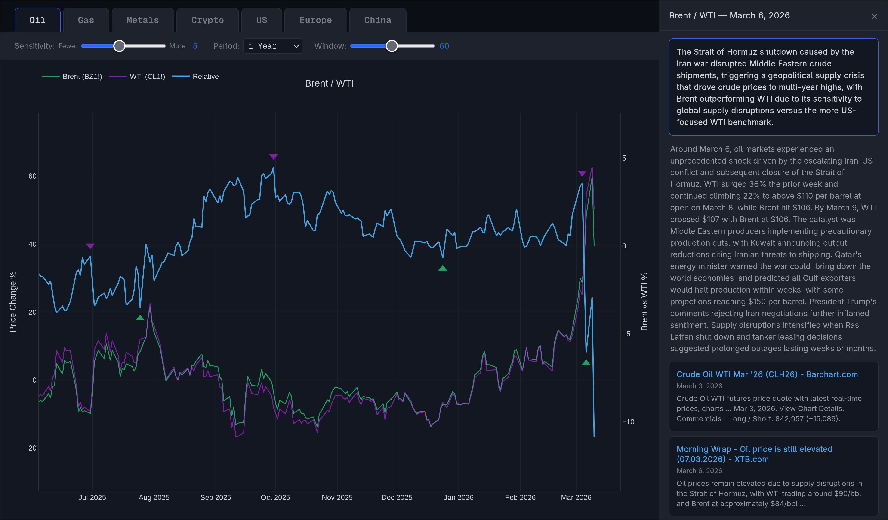

# MarketSpreadViz

An interactive visualization tool for exploring price dynamics between related market pairs with automated explanations based on real news data.

This started with the question why there are two oil prices. Brent is seaborne and globally exposed, WTI is landlocked at Cushing, Oklahoma and the spread between them reflects geopolitical risk and supply chain dynamics that neither price shows alone.



## How it works

The chart plots **rolling momentum** — percentage change over a configurable window — rather than raw prices. This makes pairs with different price scales directly comparable. The spread line is the difference between the two momentum curves.

**Spike detection** uses `scipy.signal.find_peaks` with a prominence threshold derived from the spread's rolling standard deviation, scaled by a sensitivity slider. Each candidate then goes through lookahead confirmation — it only counts if the spread actually follows through within the next window period.

Clicking a spike arrow queries **Perplexity Sonar** for a contextual explanation of the divergence. This works better than news scraping because Sonar reasons over search results and returns structured analysis rather than keyword-matched links.

The same logic extends naturally to TTF vs Henry Hub for gas but also more broad comparisons can be drawn between pairs like gold and silver, as well as equities and crypto.

## Pairs

| Tab | Spread | Why |
|-----|--------|-----|
| Oil | Brent / WTI | Same crude, different geography and supply exposure |
| Gas | TTF / Henry Hub | Same commodity, different continent and infrastructure |
| Metals | Gold / Silver | Classic ratio, centuries of market significance |
| Crypto | Bitcoin / Ethereum | Relative momentum within digital assets |
| US | S&P 500 / Nasdaq | Broad market vs tech-heavy divergence |
| Europe | Dow / Euro Stoxx 50 | Transatlantic equity spread |
| China | ACWI / FXI | Global vs China via US-listed ETFs to avoid timezone skew |

## Setup

```bash
pip install -r requirements.txt
```

Create a `.env` with a [Perplexity API key](https://docs.perplexity.ai) for the news panel:
```
PERPLEXITY_API_KEY=your_key_here
```

Everything works without it though you won't be getting explanations when clicking a spike arrow.

## Run

```bash
python main.py
```

Opens at localhost. Built with FastAPI, vanilla JS, Plotly.js, Yahoo Finance, and Perplexity Sonar.